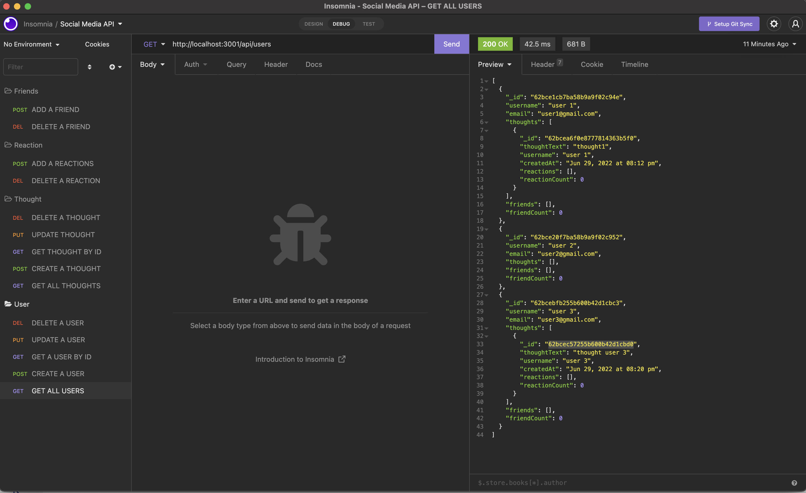

# Socialmedia-api
  
  
  Check out the badges hosted by [shields.io](https://shields.io/).
  
  ## Description 
  
  
  It's an API for a social network web application where users can share their thoughts, react and add friends.
  ## Table of Contents
  * [Screenshot](#screenshot)
  * [Installation](#installation)
  * [Usage](#usage)
  * [Contributing](#contributing)
  * [Tests](#tests)
  * [License](#license)

  ## Screenshot

  ## Video

  
  
  ## Installation
  
  Clone Repo 

  `https://github.com/juanestuniga/socialmedia-api.git`
  
  Install dependencies:

  `npm install` 
  
  ## Usage 
  
  
  After installation use 
  
  `npm start`
  
  ## Contributing
  
  
  n/a
  
  ## Tests
  
  
  n/a
  
  ## License
  
  MIT
  
  ---
  
  ## Questions?
  
  
  For any questions, please contact me with the information below:
 
  GitHub: [@juanestuniga](https://api.github.com/users/juanestuniga)